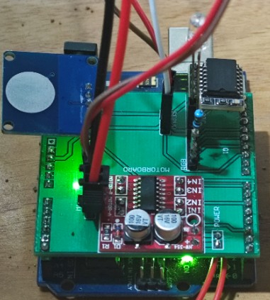
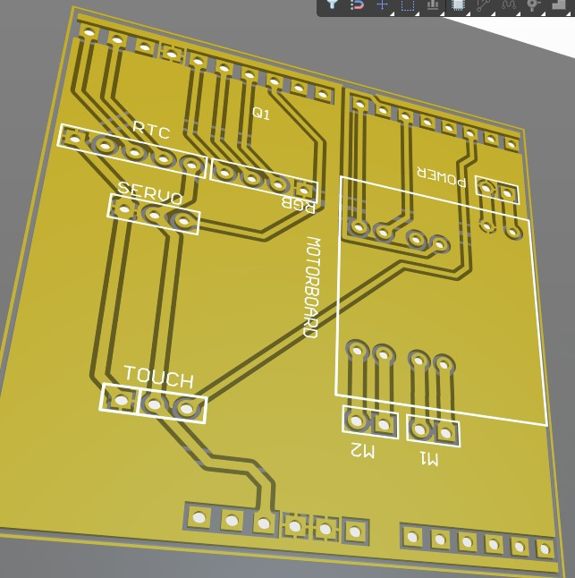

# Arduino 自动喂鱼、换水和照明系统

图片：

pcb 工程也在这里了

## 项目简介
本项目基于Arduino开发，旨在实现自动喂鱼、换水和照明功能。该系统使用RTC模块进行时间控制，使用舵机进行喂食，使用水泵进行换水，并通过LED控制照明。

## 功能介绍
- **自动喂食**：每天定时喂食两次，分别在上午9点和下午5点。
- **自动换水**：每天定时换水，时间为下午4点到4点15分。
- **自动照明**：每天早上8点到下午2点进行照明。
- **手动控制**：通过按钮实现手动喂食和换水。按钮单击可手动喂食，双击可手动进行一次换水。

## 硬件需求
- Arduino 主板
- RTC 模块（DS3231）
- 舵机
- 水泵
- 电机控制板
- LED灯
- 按钮
- 其他电子元件（电阻、跳线等）

## 软件库
在使用此项目代码之前，请确保安装以下Arduino库：
- `Servo`：用于控制舵机。
- `RTClib`：用于RTC模块。
- `OneButton`：用于按钮控制。

## 电路连接
- 舵机连接到数字引脚10
- 水泵通过电机控制板连接到数字引脚6
- LED灯连接到数字引脚5
- 按钮连接到数字引脚2
- RTC模块通过I2C连接到Arduino